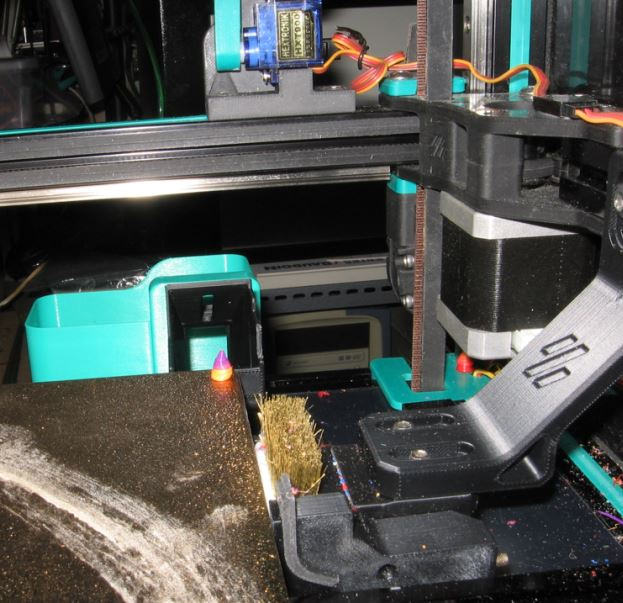

# **BLOBIFIER - LITE - For Voron 2.4 350mm only**

### **I made this repo public, but it is specifically made for my setup. It may or may not work with your setup. Use it at your own risk. I will not make changes to accommodate your setup.** 

* **My setup is as follow :** 
  * Printer : Voron 2.4 350mm with stealthburner and Pheatus Dragon SF.
    * the print head back is modified to optimize the kick of the blob into the external bucket.
  * ERCF 13 gates
  * Filametrix with modified lever and depressor on servo
  * Blobifier lite version
* **My workflow is as follow :**
  * gates 0 to 9 have always the same filaments (PLA black to white following the standard color code)
  * gates 10 to 12 have no dedicated filaments. They can be anything depending what I need to print.
  * I use ERCF more as a color/filament selector than for multicolor prints.
  * I often print the same gcode in different colors using the TTG function of HH. (this is why I don't use the slicer purge volume matrix)
    * Therefore, I don't use the following features from HH : 
      * MMU_START_SETUP
      * MMU_START_CHECK
      * MMU_END
    * I set HH as follow : 
      *  enable_park: **False**
      *  enable_park_standalone: **False**
      *  restore_xy_pos: **'"none"'**
          *  I find it is better to let the slicer go where it needs to go.
      *  park_after_form_tip: **False**
      *  restore_position: **True**
      *  user_pre_unload_extension: **'"BLOBIFIER_PARK"'**
      *  user_pre_load_extension: **'"PRE_LOAD"'**
          *  This force the toolhead to go at BLOBIFIER_PARK position for the first filament load
      *  user_post_load_extension: **'"BLOBIFIER"'**
   
       

* **In this lite version of blobifer I don't use :**
   * the servo
   * the tray
   * the bucket
   * the shaker
   * the blob counter
   * the initialize routine
   * the purge volumes from the slicer
   * the original purge volume from Happy Hare tool to tool
  
 * **Instead I use :**
   *  a build in purge volume matrix build into the purge_volume.cfg file, the purge volumes are saved in mmu_vars.cfg
   *  the purge volume can be initialized manually or by copy/paste from a spreadsheet 
   *  a gate to gate instead of the from tool to tool purge volume
      *  This allow to print the same model in different color using the Happy Hare Tool To Gate mapping function without re-slicing the STL.
   *  macro to adjust the purge volume at any time, even during printing
   *  a gantry mounted brush and wiper based on this : https://www.thingiverse.com/thing:590448
      *  The wiper is made from 2 pieces of silicone rubber 1mm thick
  
* **I make the blob directly on the bed of a Voron 2.4 350mm.**
  * I use a ramp to get the blob out of the printer into an external bucket
  * I use the toolhead to kick the blob out of the bed into the external bucket
  * STLs are made for my printer, there are no STL for other printers.

See a video in this post on discord : https://discord.com/channels/460117602945990666/909743915475816458/1241678897649815625
